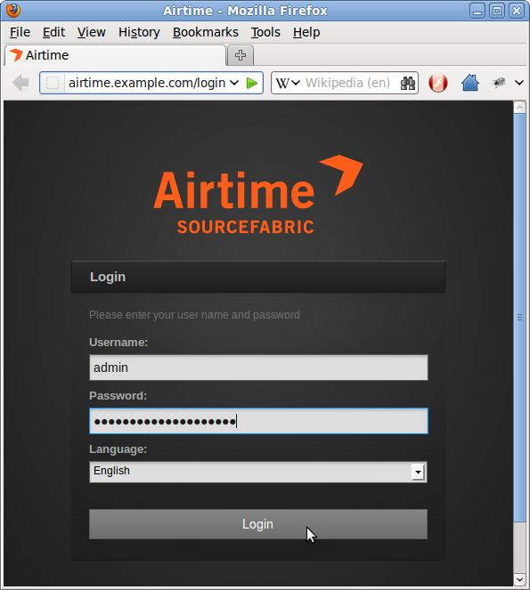
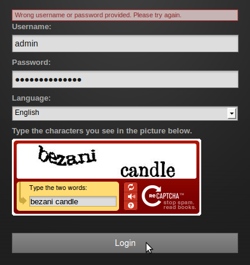
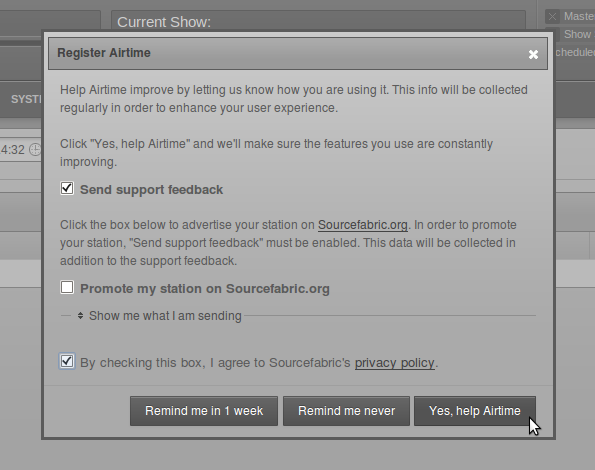
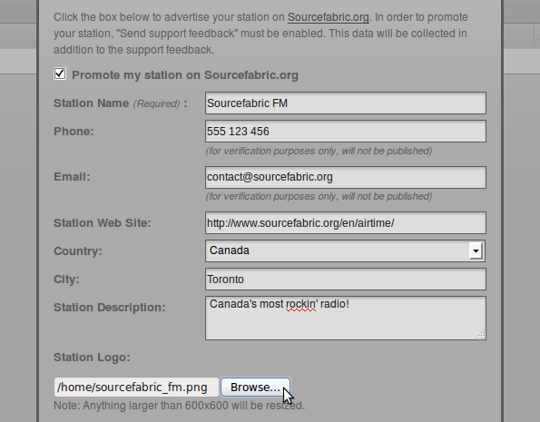
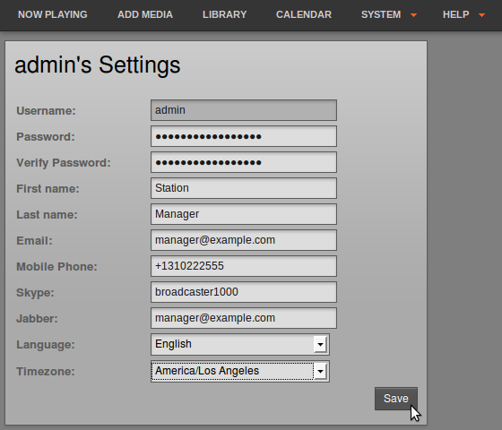
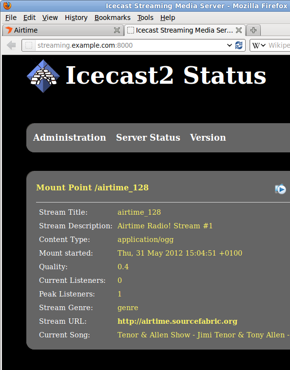

Getting started
===============

You can access the Airtime administration interface by opening your *airtime.pro* domain name in your web browser, for example:

    https://example.airtime.pro/

If you are the station administrator, log in with the user name *admin* and the password given to you. Your browser should automatically focus on the **Username** field.

If you enter the password incorrectly three times, you will be presented with a reCAPTCHA challenge to prove that you are a human, and not a password-guessing robot. This feature helps protect your Airtime installation against brute force attacks.

Register Airtime
----------------

After you have logged in as *admin* for the first time, a pop-up window will ask if you wish to send technical support data about your server to Sourcefabric.

These details can be viewed by clicking on the **Show me what I am sending** link, which expands a scrolling window. The data helps Sourcefabric engineers resolve any problems with your Airtime installation, as well as count the number of installations worldwide.

Sourcefabric has a privacy policy regarding data collection, which you can read by clicking the link to <http://www.sourcefabric.org/en/about/policy/> further down. After checking the **Send support feedback** and **privacy policy** boxes, you can submit the data by clicking the **Yes, help Airtime** button.

This window also offers the opportunity to **Promote my station on Sourcefabric.org** (on the page <http://www.sourcefabric.org/en/airtime/whosusing/>) by checking the box. Fill in the form which will appear with some details about your station. The contact details are only requested for verification purposes, and will not be made available to the public. Click the **Browse** button to select a **Station Logo** image from the file manager on your computer.

The Master Panel
----------------

After the pop-up window is closed, you should now see the **Master Panel**, which is present at the top of every page of the Airtime interface. On the left hand side, the Master Panel displays the details of the **Previous** file played out, the current file playing (with an orange progress bar and time elapsed/time remaining), and the details of the **Next** file due to play. It also displays the name and scheduled time of the current show, with a blue progress bar.

Beneath this side of the Master Panel is the main navigation menu, with sub-menus labelled **Now Playing**, **Add Media**, **Library**, **Calendar**, **System**, **History** and **Help**. We'll be looking at the contents of these menus in the following chapters of this book.

On the right hand side of the Master Panel are the switches for the **Source Streams**, which enable you to switch from scheduled play to remote live sources, and back. (See the chapter *Stream settings* for details of this feature). The **On Air** indicator turns from dark grey to red whenever audio is being played out. Underneath this indicator is a **Listen** button, which opens a pop-up player that can be used to audition the available playout streams.

There is also a clock indicating the **Station time** and time zone. Beneath the clock and just to the left, the name of the user currently logged in is displayed, and there is the link for you to **Logout**. 

Clicking the username link opens a page in which you can update your Airtime password, contact details, language and time zone preferences. Click the **Save** button once you have made the changes that you require.

Checking an Icecast server
--------------------------

You can check that Icecast is running by opening its default server port of 8000 in your web browser. For example, using the domain name of the Icecast server found on the **Stream Settings** page:

    http://example.out.airtime.pro:8000/ 

You should see the Icecast status page, with details of any connections that your Airtime server has made to this Icecast server. If you have only just started with Airtime, there may not be any media playing out yet.

